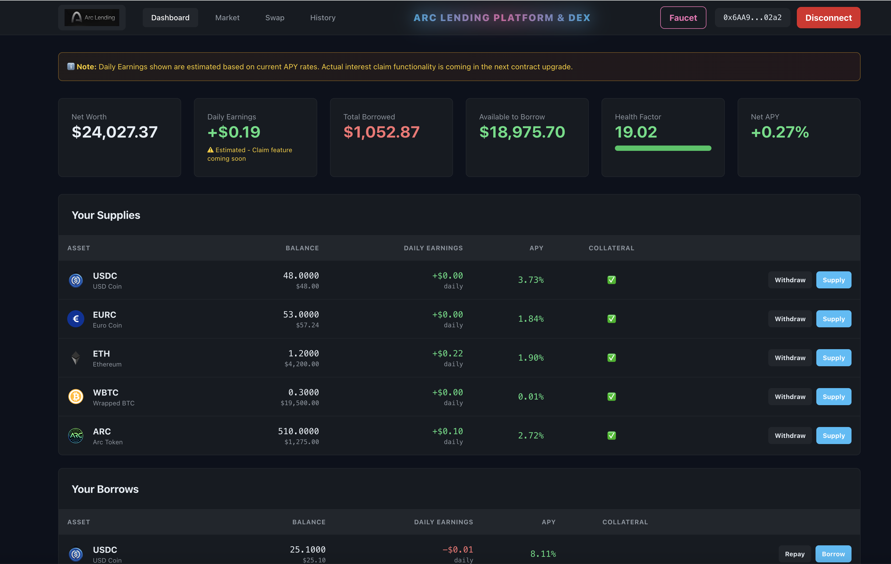
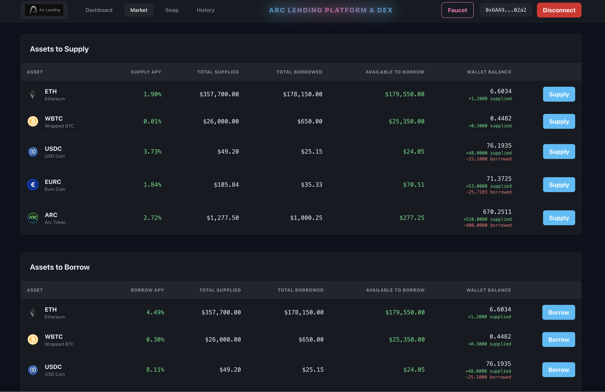
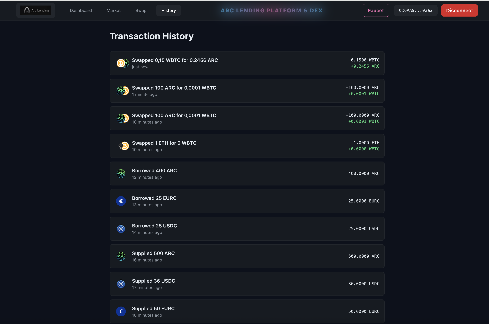

# ARC Testnet Lending Protocol 🏦

Complete DeFi ecosystem on Arc blockchain: lending pools, AMMs, and scheduled payouts. Built with Solidity + Foundry, React + Vite. **20/20 tests passing.**

[](#) [](LICENSE)

## ⚠️ Testnet & MVP Notice

**This is a testnet MVP (Minimum Viable Product)  not production ready.**

- 🧪 **Testnet Only**: Deployed on Arc Testnet only
- 💰 **Test Funds Only**: Use testnet funds exclusively (no real assets)
- 🚀 **MVP Status**: Core features complete but requires security audit before mainnet
- 📋 **For Development & Testing**: Learning DeFi mechanics, protocol testing, and demos

**Do NOT use with mainnet tokens or real funds.**

---

## Overview

- **Lending Pool**: Collateralized borrowing with health factor management
- **AMM Pairs**: Three constant product pairs (ETH/WBTC, ETH/ARC, WBTC/ARC) with 0.3% fees
- **Scheduled Payouts**: Time locked fund releases
- **Frontend Demo**: React UI for protocol interaction
- All contracts verified and audited on Arc Testnet

## 🚀 Live Demo

**Frontend Application**: [https://arclending.vercel.app/](https://arclending.vercel.app/)

Connect your Arc Testnet wallet and start interacting with the protocol!

## Application Screenshots

**Dashboard**



**Market**



**History (Transactions)**



## Quick Links

- 🌐 **[Live Application](https://arclending.vercel.app/)** - Try the lending protocol now
- 📖 **[Developer Docs](docs/)** - Smart contract details and architecture
- 🔐 **[Security Audit](docs/dev-notes/SMART_CONTRACT_AUDIT.md)** - Contract security review
- 🛣️ **[Roadmap](ROADMAP.md)** - Future features and phases
- 🐛 **[Troubleshooting](docs/dev-notes/METAMASK_RED_ALERT_RPC_DELAY.md)** - Common issues and solutions

## Quick Start

**Requirements**: Node.js 16+, Foundry, Git

```bash
git clone https://github.com/dharmanan/ARC-Testnet-Lend.git
cd ARC-Testnet-Lend

# Install frontend
cd frontend && npm install && cd ..

# Create local .env file
cp .env.example .env

# Run tests
forge test -v

# Start frontend UI
cd frontend && npm run dev
# Open http://localhost:3000, connect MetaMask to Arc Testnet (Chain ID: 5042002)
```

⚠️ **Important**: Edit `.env` and add your `PRIVATE_KEY` and `ARC_TESTNET_RPC_URL`. **Never commit `.env` to git** it contains secrets.

## Setting Up a Testnet Wallet

Create a new testnet wallet using Foundry's `cast` command:

```bash
cast wallet new
```

Output example:
```
Successfully created new keypair.
Address:     0xB815A0c4bC23930119324d4359dB65e27A846A2d
Private key: 0xcc1b30a6af68ea9a9917f1dd••••••••••••••••••••••••••••••••••••••97c5
```

**⚠️ Important:**
- Keep your private key **secure**  never share it or commit it to source control
- Add the private key to `.env`:

```bash
PRIVATE_KEY="0xcc1b30a6af68ea9a9917f1dd••••••••••••••••••••••••••••••••••••••97c5"
```

Then reload your environment:

```bash
source .env
```

**Get testnet funds:**
- Request faucet tokens from [Circle Faucet](https://faucet.circle.com/)
- Use only testnet addresses and funds for testing
- Use only testnet addresses and funds for testing

## Smart Contracts

| Contract | Address |
|----------|---------|
| LendingPool | `0x9dD7314B876fF9dFFB4F9aC4d4c8540156cf10b9` |
| AMM (ETH/WBTC) | `0xF4638B258905C6a2F7Aa71E05aAC887dB697c338` |
| AMM (ETH/ARC) | `0x677df5298Fd0a80672b1E6B4a61BEB75534a83A1` |
| AMM (WBTC/ARC) | `0x27e14cfEF1a029A32F574263dce67371bce32d24` |

Token addresses: [CONTRACTS_REPORT.md](docs/dev-notes/CONTRACTS_REPORT.md)


## Project Structure

```
ARC-Testnet-Lend/
├── src/                # Solidity contracts
│   ├── LendingPool.sol
│   ├── GenericAMMPair.sol
│   ├── ScheduledPayoutManager.sol
│   └── ...
├── test/               # Foundry tests
│   └── Contracts.t.sol
├── script/             # Deployment & helper scripts
│   ├── Deploy.s.sol
│   ├── AddLiquidity.s.sol
│   └── ...
├── frontend/           # React + Vite frontend
│   ├── App.tsx, index.tsx, ...
│   ├── components/
│   └── assets/
├── docs/               # Guides, user & dev docs
│   ├── LENDING_POOL_GUIDE.md
│   ├── dev-notes/
│   └── images/
├── ROADMAP.md          # Project roadmap
├── DEPLOYMENT_VERIFICATION.md
├── DOCUMENTATION_INDEX.md
├── LICENSE             # MIT License
├── README.md           # This file
└── ...
```

## Roadmap

See [ROADMAP.md](ROADMAP.md) for planned features, phases, and known limitations.

## Documentation

- [DOCUMENTATION_INDEX.md](DOCUMENTATION_INDEX.md) — quick links & overview
- [LENDING_POOL_GUIDE.md](docs/LENDING_POOL_GUIDE.md) — user guide with UI walkthrough
- [SMART_CONTRACT_AUDIT.md](docs/dev-notes/SMART_CONTRACT_AUDIT.md) — security details
- [DEPLOYMENT_VERIFICATION.md](DEPLOYMENT_VERIFICATION.md) — deployment & verification

## Development

Build and test the protocol locally:

```bash
# Build contracts
forge build

# Run all tests (20 tests)
forge test -v

# Run specific test file
forge test --match-path test/Contracts.t.sol -v
```

Refer to [DOCUMENTATION_INDEX.md](DOCUMENTATION_INDEX.md) for more development workflows and debugging steps.

## Tech Stack

- **Smart Contracts**: Solidity 0.8.20 + OpenZeppelin Contracts
- **Testing**: Foundry + Solc 0.8.20
- **Frontend**: React + TypeScript + Vite
- **Styling**: Tailwind CSS
- **Blockchain**: Arc Testnet
- **RPC Integration**: ethers.js

## Security

- ⚠️ **Testnet only**  do not use with real funds or mainnet tokens
- Use only testnet wallet (create new wallet for testing)
- Never commit `.env` or private keys  use testnet secrets only
- Reentrancy guards & access controls (OpenZeppelin)
- See [SMART_CONTRACT_AUDIT.md](docs/dev-notes/SMART_CONTRACT_AUDIT.md) for security details

## Troubleshooting & Known Issues

- **MetaMask Red Alert**: RPC latency warning (not a security issue). See [METAMASK_RED_ALERT_RPC_DELAY.md](docs/METAMASK_RED_ALERT_RPC_DELAY.md)
- **Transaction Delays**: Arc Testnet RPC may be slow. Wait 5-10 seconds and refresh.
- **Contract Issues**: Check [SMART_CONTRACT_AUDIT.md](docs/dev-notes/SMART_CONTRACT_AUDIT.md) for known limitations

## Contributing

Open issues or PRs. For protocol changes, discuss in an issue first.

```bash
git checkout -b feature/my-change
forge test
git push origin feature/my-change
```

## License

MIT — [LICENSE](LICENSE)

---

For detailed guides, UI screenshots, and implementation details, see [`docs/`](docs/).
````
