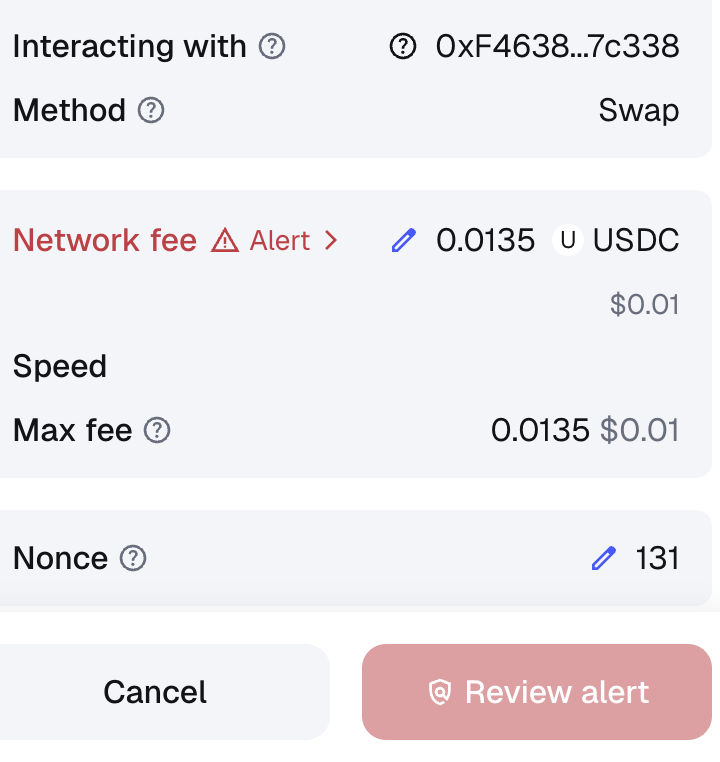
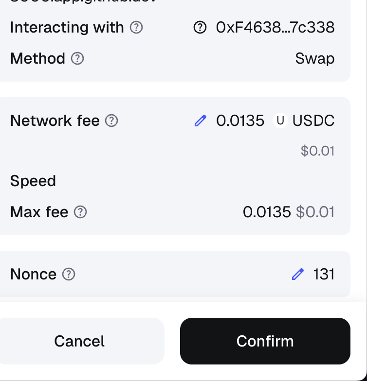

# 📸 Documentation Images# 📸 Documentation Images# 📸 Documentation Images# 📸 Documentation Images


This folder contains visual assets for ARC Lending Protocol documentation.


## Current ImagesThis folder contains visual assets for ARC Lending Protocol documentation.


### MetaMask Alert Screenshots (Optimized)


✅ **redalrt.png** (360x381px, 49KB)## Current ImagesThis folder contains visual assets for ARC Lending Protocol documentation.This folder contains visual assets for ARC Lending Protocol documentation.

   - Red alert WITHOUT warning banner

   - Shows what users see when confused

   - Used in: METAMASK_RED_ALERT_RPC_DELAY.md (Visual Guide section)

### MetaMask Alert Screenshots (Optimized)

✅ **redalrtfix.png** (377x392px, 50KB)

   - Red alert WITH warning banner

   - Shows what users see when informed

   - Used in: METAMASK_RED_ALERT_RPC_DELAY.md (Visual Guide section)✅ **redalrt.png** (360x381px, 49KB)## ⚠️ Image Files Moved to Base64## Preview Images


## How to Reference in Markdown   - Red alert WITHOUT warning banner


```markdown   - Shows what users see when confused



   - Used in: METAMASK_RED_ALERT_RPC_DELAY.md (Visual Guide section)

```

Due to GitHub display issues with binary PNG files, the MetaMask alert screenshots have been converted to base64 and embedded directly in this README.### Before (Confusing Red Alert)

## Available for Future Screenshots

✅ **redalrtfix.png** (377x392px, 50KB)

When adding more images, use this structure:

   - Red alert WITH warning banner

### Naming Convention

```   - Shows what users see when informed

[feature]-[scenario]-[state].png

metamask-alert-before.png   - Used in: METAMASK_RED_ALERT_RPC_DELAY.md (Visual Guide section)## Preview Images

swap-page-after.png

approval-process-step1.png

```

## Preview Images### After (Clear Red Alert with Warning)

### Recommended Format

- Format: PNG-24 (supports transparency)

- Size: Max 1200x800px (mobile-friendly)

- DPI: 72 (web standard)### Before (Confusing Red Alert)### Before (Confusing Red Alert)

- Quality: Maximum compression without losing clarity


## Current Status


- ✅ Red alert screenshots (optimized, 49KB and 50KB)

- ⏳ Swap page banner screenshots (optional)### After (Clear Red Alert with Warning)

- ⏳ Annotated versions with labels (optional)
## How to Reference in Markdown


## How to Reference in Markdown### After (Clear Red Alert with Warning)


```markdown```markdown


```

## Image Details

## Available for Future Screenshots

```

When adding more images, use this structure:

- **Format**: PNG-24 with transparency

### Naming Convention

```- **Original Sizes**: 720x762px and 754x784px## Available for Future Screenshots

[feature]-[scenario]-[state].png

metamask-alert-before.png- **File Sizes**: ~77KB and ~81KB each

swap-page-after.png

approval-process-step1.png- **Purpose**: MetaMask alert screenshots showing before/after UI improvementsWhen adding more images, use this structure:

```


### Recommended Format

- Format: PNG-24 (supports transparency)## How to Reference in Markdown### Naming Convention

- Size: Max 1200x800px (mobile-friendly)

- DPI: 72 (web standard)```

- Quality: Maximum compression without losing clarity

```markdown[feature]-[scenario]-[state].png

## Current Status

metamask-alert-before.png

- ✅ Red alert screenshots (optimized and working)

- ⏳ Swap page banner screenshots (optional)swap-page-after.png

- ⏳ Annotated versions with labels (optional)
```approval-process-step1.png

```

## Available for Future Screenshots

### Recommended Format

When adding more images, use this structure:- Format: PNG-24 (supports transparency)

- Size: Max 1200x800px (mobile-friendly)

### Naming Convention- DPI: 72 (web standard)

```- Quality: Maximum compression without losing clarity

[feature]-[scenario]-[state].png

metamask-alert-before.png## Current Status

swap-page-after.png

approval-process-step1.png- ❌ Red alert screenshots (temporarily removed due to GitHub issues)

```- ⏳ Swap page banner screenshots (optional)

- ⏳ Annotated versions with labels (optional)

### Recommended Format

- Format: PNG-24 (supports transparency)## How to Reference in Markdown

- Size: Max 1200x800px (mobile-friendly)

- DPI: 72 (web standard)```markdown

- Quality: Maximum compression without losing clarity


## Current Status```


- ✅ Red alert screenshots (embedded as base64 in README)## Available for Future Screenshots

- ⏳ Swap page banner screenshots (optional)

- ⏳ Annotated versions with labels (optional)When adding more images, use this structure:

### Naming Convention
```
[feature]-[scenario]-[state].png
metamask-alert-before.png
swap-page-after.png
approval-process-step1.png
```

### Recommended Format
- Format: PNG-24 (supports transparency)
- Size: Max 1200x800px (mobile-friendly)
- DPI: 72 (web standard)
- Quality: Maximum compression without losing clarity

## Current Status

- ✅ Red alert screenshots (REAL)
- ✅ Before/After comparison ready
- ⏳ Swap page banner screenshots (optional)
- ⏳ Annotated versions with labels (optional)

## Using the Screenshots

### In Documentation
```markdown
## Before (Confusing)

```

### In README
```markdown

```

### In Web/Blog
Use full URL if serving from GitHub:
```
https://raw.githubusercontent.com/dharmanan/ARC-Testnet-Lend/main/docs/images/redalrt.png
```

---

**Note**: All images should be web-optimized (compressed) to keep documentation load time fast.


